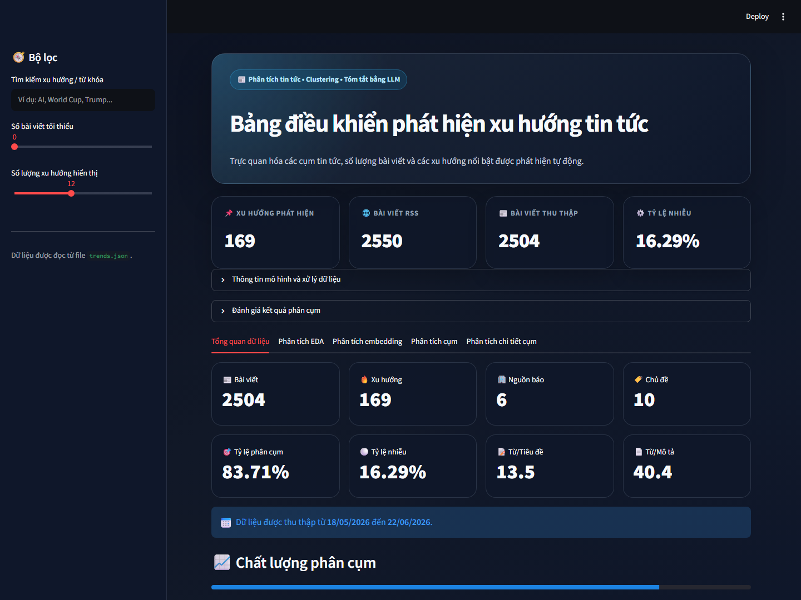
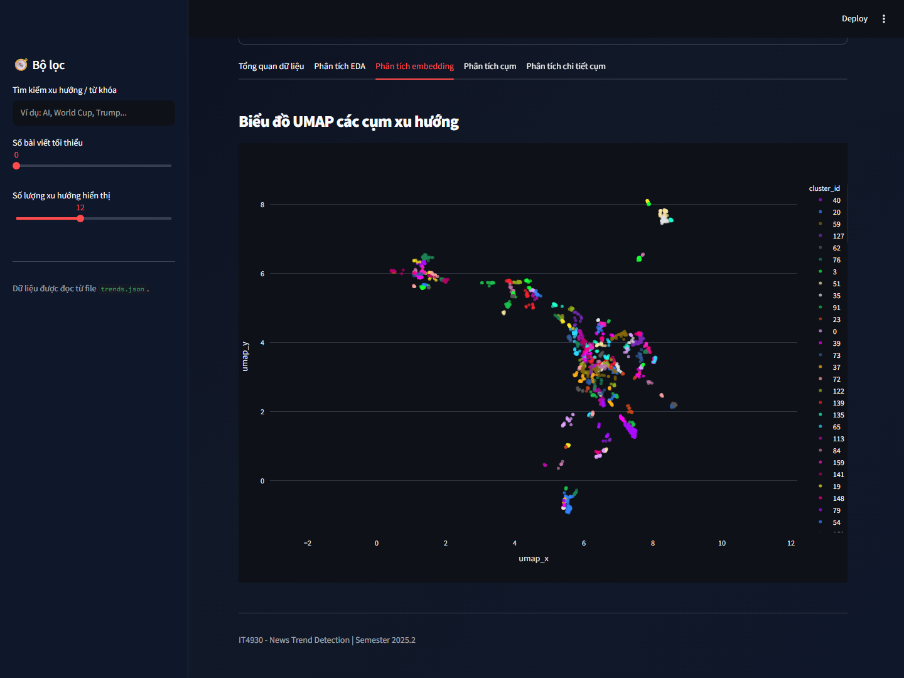
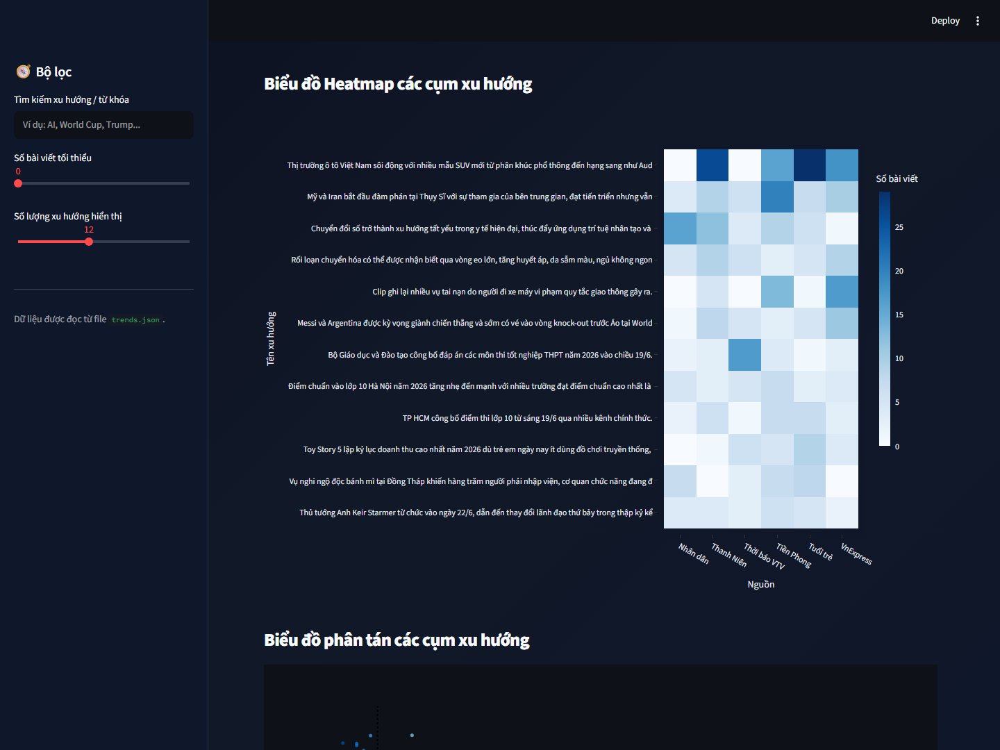
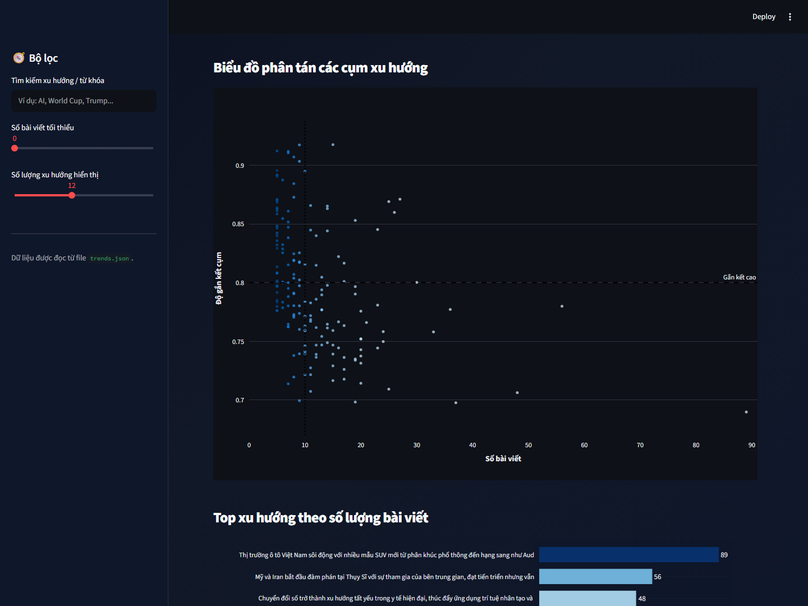

# Bảng điều khiển khám phá xu hướng tin tức

## Giới thiệu

News Trend Detection là dashboard tương tác xây dựng bằng Streamlit, giúp khám phá các chủ đề đang xuất hiện trong tập hợp tin tức tiếng Việt. Từ dữ liệu đã được thu thập và phân cụm, người dùng có thể xem bức tranh tổng quan, khảo sát đặc điểm bài viết, quan sát không gian embedding UMAP, so sánh các cụm xu hướng và đọc những bài viết tiêu biểu.

Ứng dụng tập trung vào **khám phá và diễn giải kết quả phân tích**: dữ liệu đầu vào đã chứa thông tin xu hướng, bài viết, chỉ số đánh giá và tọa độ embedding. Dashboard không thực hiện thu thập RSS, trích xuất bài viết hay huấn luyện mô hình khi khởi chạy.

### Điểm nổi bật

- Tổng hợp quy mô và chất lượng dữ liệu qua các chỉ số phân cụm.
- Hỗ trợ khảo sát phân bố thời gian, chủ đề, nguồn tin và đặc điểm văn bản.
- Trình bày các xu hướng dưới dạng biểu đồ, bảng và trang chi tiết.
- Cho phép thu hẹp kết quả bằng bộ lọc trên sidebar.



## Biểu đồ nổi bật

### Không gian embedding UMAP

Mỗi điểm biểu diễn một bài viết; màu sắc phân biệt các cụm xu hướng để quan sát mức độ tập trung và tương quan giữa các nhóm tin.



### Phân bố nguồn tin theo cụm

Heatmap cho biết số bài viết từ từng nguồn tin trong các xu hướng nổi bật, giúp so sánh mức độ đóng góp của các báo giữa các cụm.



### Quy mô và độ gắn kết của cụm

Biểu đồ phân tán đặt số lượng bài viết cạnh độ gắn kết của từng cụm; các đường tham chiếu đánh dấu những ngưỡng được dùng trong dashboard.



## Thống kê dữ liệu mẫu

Các số liệu dưới đây được tính từ `trends.json` có trong repository. Đây là ảnh chụp dữ liệu được tạo ngày **22/06/2026**; kết quả sẽ thay đổi khi thay bằng một tệp dữ liệu khác.

| Chỉ số | Giá trị |
| --- | ---: |
| Bài viết từ nguồn RSS | 2.550 |
| Bài viết đã thu thập | 2.504 |
| Bài viết được gán vào xu hướng | 2.096 |
| Bài viết nhiễu, chưa gán cụm | 408 (16,29%) |
| Xu hướng/cụm được phát hiện | 169 |
| Độ bao phủ phân cụm | 83,71% |
| Nguồn tin có bài viết trong tập xu hướng | 6 |
| Nhóm chủ đề | 10 |
| Khoảng thời gian bài viết | 18/05/2026–22/06/2026 |

**Cấu hình và mô hình được ghi trong dữ liệu:** embedding `BAAI/bge-m3`; LLM `Qwen/Qwen2.5-7B-Instruct` (lượng tử hóa 4-bit); cấu hình HDBSCAN có `min_cluster_size=5`, `min_samples=2`, `cluster_selection_method=eom`. Các chỉ số này mô tả tệp dữ liệu mẫu, không phải cam kết về chất lượng hoặc kết quả của những bộ dữ liệu khác.

## Dữ liệu đầu vào

Ứng dụng đọc `trends.json` trong thư mục làm việc. Tệp chứa danh sách `trends` cùng metadata tổng hợp như `metrics`, thông tin mô hình và thời điểm tạo dữ liệu. Mỗi xu hướng gồm tên, thứ hạng, mã cụm, độ gắn kết và danh sách bài viết thuộc cụm đó.

Thông tin của mỗi bài viết bao gồm tiêu đề, mô tả, thời điểm xuất bản, chủ đề và nguồn tin. Tọa độ `umap_x` và `umap_y` xác định vị trí bài viết trên biểu đồ embedding. Từ các trường này, ứng dụng xây dựng bảng dữ liệu, tính toán đặc trưng văn bản và thời gian, rồi trình bày các thống kê và biểu đồ.

Các chỉ số trong `metrics` cung cấp số liệu tổng hợp như số bài viết đã thu thập, số cụm, độ bao phủ phân cụm và tỷ lệ nhiễu. `model` và `generated_at` mô tả mô hình cùng thời điểm tạo kết quả. Nếu không tìm thấy tệp hoặc danh sách xu hướng rỗng, ứng dụng sẽ hiển thị thông báo và dừng.

## Luồng xử lý và phân tích

```text
trends.json
    │
    ▼
Nạp payload (trends, metrics, model, generated_at)
    │
    ▼
Chuẩn hóa thành bảng xu hướng và bảng bài viết
    │
    ├── Bổ sung thông tin cụm cho từng bài viết
    ├── Tính đặc trưng văn bản và thời gian
    └── Chuẩn hóa tên chủ đề để hiển thị
    │
    ▼
Sidebar lọc xu hướng ──► Các chỉ số tổng quan
    │
    ▼
5 khu vực khám phá dữ liệu
```

1. **Nạp dữ liệu:** `data.loader` đọc JSON và lấy danh sách xu hướng cùng metadata. Tệp đầu vào phải có cấu trúc phù hợp; bước nạp không thay thế cho việc kiểm định chất lượng dữ liệu.
2. **Chuẩn hóa:** `data.preprocess` tạo bảng xu hướng và bảng bài viết. Các trường cụm được gắn vào từng bài viết; số từ, số ký tự, ngày/giờ xuất bản và tên chủ đề tiếng Việt được chuẩn bị cho các phân tích tiếp theo.
3. **Lọc và tổng quan:** sidebar cung cấp bộ lọc cho các màn hình phân tích; phần đầu trang hiển thị số xu hướng, số bài RSS, số bài đã thu thập và tỷ lệ nhiễu. Thông tin mô hình và các chỉ số đánh giá được trình bày trong phần mở rộng.
4. **Khám phá theo góc nhìn:** năm tab lần lượt trình bày tổng quan tập dữ liệu, EDA, tọa độ embedding UMAP, phân tích cụm và chi tiết cụm. Phần phân tích cụm kết hợp phân bố nguồn tin, quy mô/độ gắn kết và danh sách xu hướng; phần chi tiết hiển thị thông tin cùng các bài viết liên quan.

Các tọa độ UMAP, nhãn cụm và chỉ số đánh giá được đọc từ dữ liệu đầu vào. Do đó, dashboard trực quan hóa kết quả đã tạo sẵn thay vì tính lại embedding hay chạy HDBSCAN mỗi lần người dùng mở ứng dụng.

## Cài đặt

Từ thư mục gốc của repository:

```bash
git clone https://github.com/trumcodelord/new_trends_demo.git
cd new_trends_demo
python -m venv .venv
```

Kích hoạt môi trường ảo:

```bash
# Windows (PowerShell)
.venv\Scripts\Activate.ps1

# macOS / Linux
source .venv/bin/activate
```

Cài các thư viện được khai báo trong `requirements.txt`:

```bash
python -m pip install -r requirements.txt
```

## Khởi chạy

Chạy tại thư mục gốc, nơi có `app.py` và `trends.json`:

```bash
streamlit run app.py
```

Mở địa chỉ Streamlit hiển thị trong terminal, thường là `http://localhost:8501`.

## Cấu trúc dự án

```text
new_trends_demo/
├── app.py                       # Điểm khởi chạy và điều phối dashboard
├── trends.json                  # Dữ liệu xu hướng mẫu
├── requirements.txt             # Thư viện Python
├── news-trend-detection.ipynb   # Notebook trong repository
├── assets/                      # CSS sáng/tối và stopwords tiếng Việt
├── data/                        # Nạp JSON và chuẩn hóa dữ liệu
├── general/                     # Sidebar, header và các chỉ số
├── dataset_overview/            # Tổng quan tập dữ liệu
├── eda_analysis/                # Phân tích khám phá dữ liệu
├── embedding_anslysis/          # Biểu đồ UMAP
├── trends_analysis/             # Biểu đồ và bảng xu hướng
└── trend_detail_analysis/       # Thông tin và bài viết chi tiết
```
